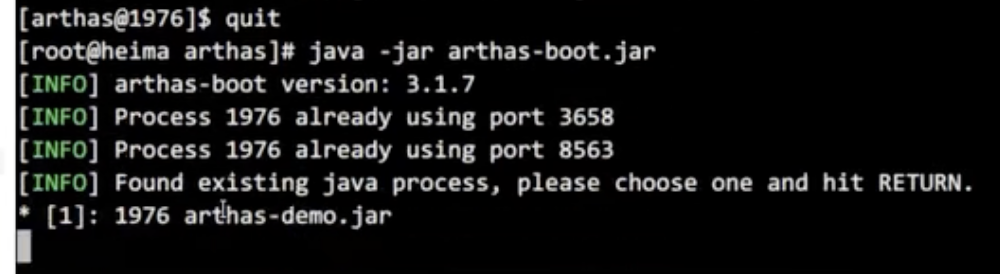
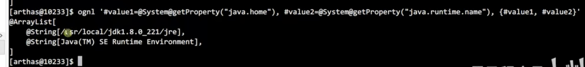
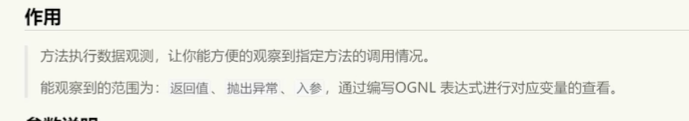

# Arthas

```
Alibaba开源的Java诊断工具。
```

# 一、Arthas启动

首先在linux/macOS/windows上安装Arthas，之后切换到对应的目录。`java -jar arthas-boot.jar 启动`

注意启动之前，需要有java项目已经启动，因为arthas启动时会自动寻找机器上的java进程，然后让用户指定粘附哪个java进程。


# 二、命令

### 1. [dashboard]显示仪表盘


### 2.[thread]查看线程情况


### 3. [thread 线程号]查看指定的线程


### 4.[jad 包名类名]反编译


### 5.[watch 包名类名 方法 返回值]监视


### 6.退出arthas



使用quit或者exit命令，可以退出当前的连接。但是粘附到目标进程上的arthas还会继续运行，端口会保持开放，下次连接可以直接连接上。如果想完全退出arthas，可以执行stop命令，它会关闭服务。

### 7.[help]显示所有命令

### 8.[cat]打印文件内容，同linux

### 9.session查看会话的信息：进程的ID、会话ID

### 10.reset重置增强类，将被Arthas增强过的类全部还原。

```shell
还原指定类
reset Test

还原所有以List结尾的类
reset *List

还原所有的类
reset
```


`trace 包名类名 方法名`追踪某一个方法的执行。


### 11.version查看arthas版本号


### 12.history查看输入的历史命令


### 13.keymap查看快捷键

# 三、JVM相关命令

### 1.dashboard 仪表板


### 2.thread查看JVM的线程的堆栈信息


诊断死锁


查看处于等待状态的进程


### 3.jvm查看虚拟机相关

### 4.sysprop查看和修改JVM的系统属性

查看指定信息和修改指定信息。


### 5.sysenv 查看当前JVM的环境属性

```
查看所有的属性
sysenv

查看指定属性
sysenv 属性名

```


### 6.vmoption查看、更新VM诊断相关的参数


### 7.getstatic查看类的静态属性

`getstatic 包名类名 属性名`·


### 8.ognl 执行ognl表达式，3.0.5版本新增功能


输出的是返回值，所以是null。

获取类的静态属性


@表示静态，这是ognl的语法。



# 四、Arthas核心指令

## 4.1 dump将已加载的字节码文件保存到特定目录


显然易见，dump命令的作用就是将指定类的字节码文件保存下来，保存目录是在arthas的logs下。

## 4.2 classloader获取类加载器的信息

1. 将JVM中所有的classloader的信息统计出来，并且可以展示继承树，urls等。

2. 可以让指定的classloader去getResources，打印出所有查找到的resource的url。对于ResourceNotFoundException异常比较有用。
3. 


## 4.3 monitor 监视指定指定类中方法的执行情况

用来监视一个时间段中某个方法的执行次数。

monitor命令是一个非实时返回命令，实时返回命令是输入之后立即返回，而非实时返回的命令，则是不断的等待目标Java进程返回信息，直到用户输入`Ctrl+C`为止。


为什么会有失败？因为代码里面写了满足某条件抛出异常的一段代码。

## 4.4 watch观察方法的执行、调用情况




例子：


