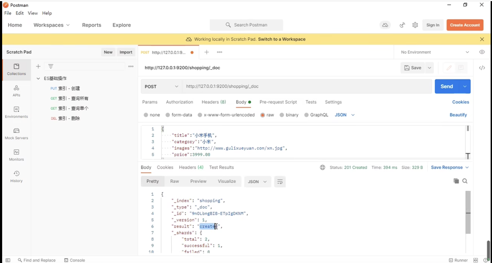
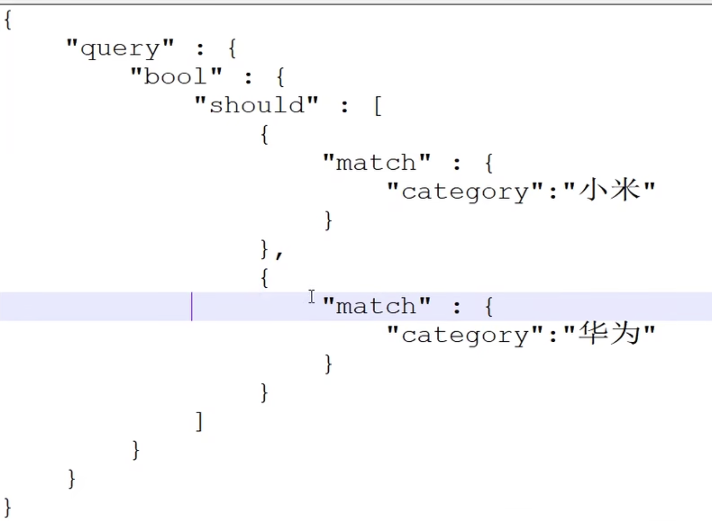
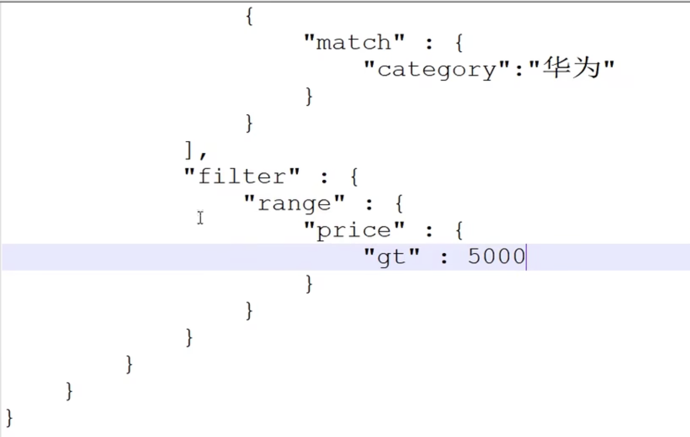
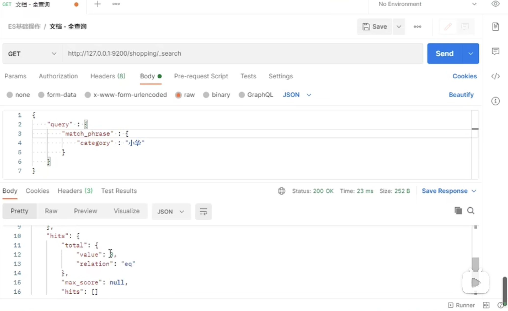

# ES

## 一、基础操作

## 1、什么是elasticsearch？

ES是一个开源的高扩展的**分布式全文搜索引擎**，是整个Elastic Stack技术栈的核心。他可以近乎实时的存储、检索数据，本身扩展性很好，可以扩展到上百台服务器，处理PB级别的数据。

## 2、创建索引

创建索引只能使用put请求，不能使用post。如果PUT完，再次PUT，则提示已经存在。说明PUT是满足幂等性的。post为什么不能使用，因为它不具有幂等性。

## 3、如何查看所有的索引信息？

使用`http://127.0.0.1:9200/_cat/indices?v`

## 4、删除索引

## 5、创建文档

索引创建好之后，接下来创建文档，创建文档可以使用post请求。

多次提交可以发现返回的id不同，说明post请求是不具有幂等性的。那么如果实现幂等性如何操作呢？-->指定id

## 5、创建文档时指定id

## 6、查询文档数据

### 6.1 根据id查询

### 6.2 查询所有数据

## 7、更新文档数据

### 7.1 全量数据更新

### 7.2 局部数据更新

## 8、删除文档数据

## 9、按照条件查询

将条件输入到请求题当中，注意还是GET请求。

全量查询

## 10、分页查询

通过size自动将数据划分为若干页，之后通过from，指定需要查询的页的开始位置。

通过"_source"指定想查看的字段

## 11、数据排序

## 12、条件查询

需要满足多个条件如何查询

满足或如何查询？

如果再加个">"条件呢？

## 13、ES的倒排索引

看这个例子，为什么可以根据“小华”查询到数据，因为小华被分词了，先根据”小“查询，又根据“华”查询。

如果想精准匹配，需要使用`match_phrase`

## 14、对查询内容进行高亮显示

指定需要高亮哪些字段。

