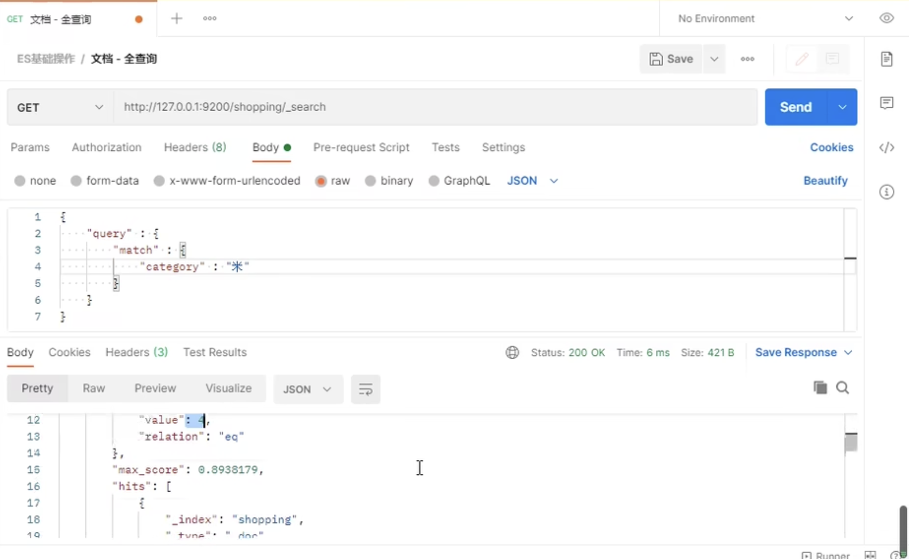
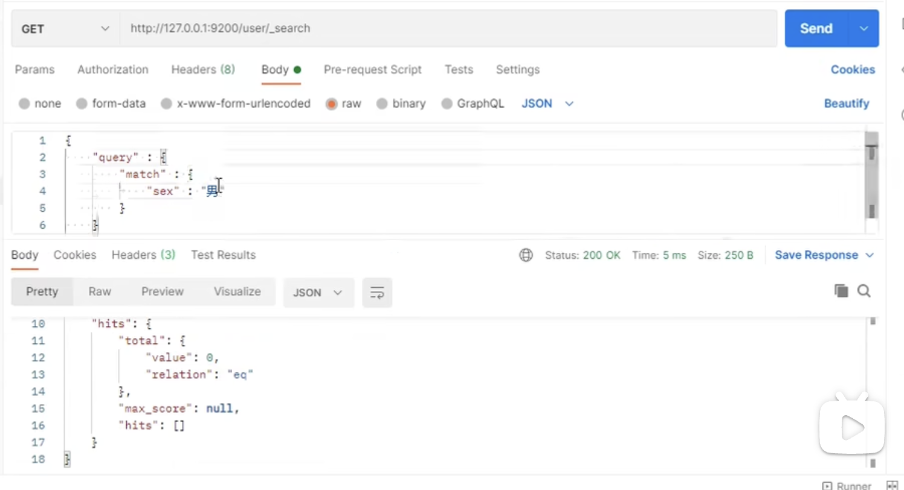
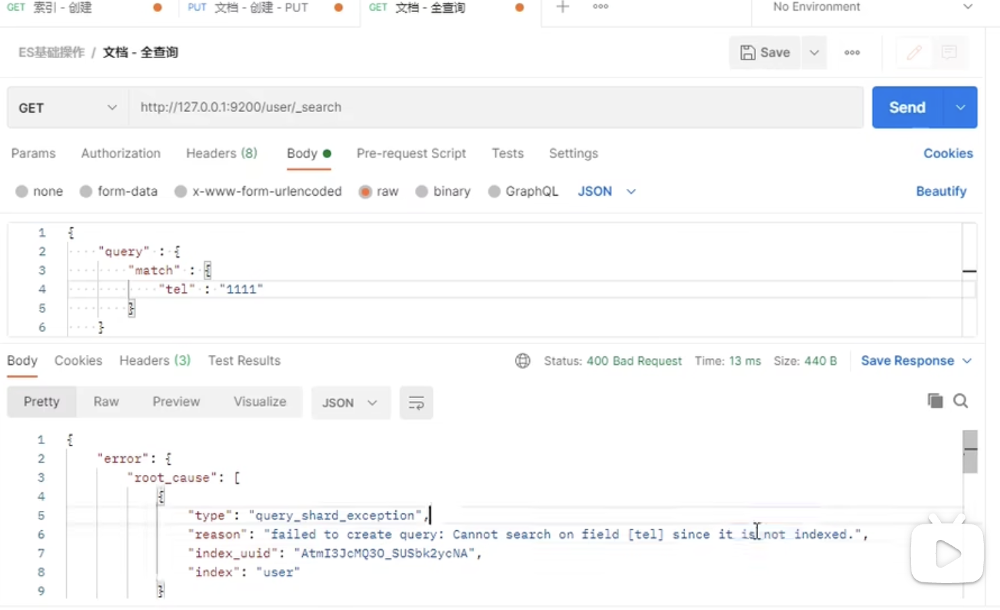
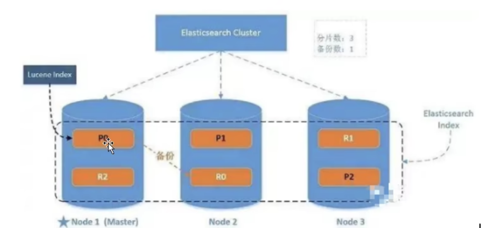

# ES

## 一、基础操作

## 1、什么是elasticsearch？

ES是一个开源的高扩展的**分布式全文搜索引擎**，是整个Elastic Stack技术栈的核心。他可以近乎实时的存储、检索数据，本身扩展性很好，可以扩展到上百台服务器，处理PB级别的数据。


## 2、创建索引


创建索引只能使用put请求，不能使用post。如果PUT完，再次PUT，则提示已经存在。说明PUT是满足幂等性的。post为什么不能使用，因为它不具有幂等性。

## 3、如何查看所有的索引信息？

使用`http://127.0.0.1:9200/_cat/indices?v`


## 4、删除索引


## 5、创建文档


索引创建好之后，接下来创建文档，创建文档可以使用post请求。


多次提交可以发现返回的id不同，说明post请求是不具有幂等性的。那么如果实现幂等性如何操作呢？-->指定id

## 5、创建文档时指定id


## 6、查询文档数据

### 6.1 根据id查询


### 6.2 查询所有数据


## 7、更新文档数据

### 7.1 全量数据更新


### 7.2 局部数据更新


## 8、删除文档数据


## 9、按照条件查询

将条件输入到请求题当中，注意还是GET请求。


全量查询


## 10、分页查询

通过size自动将数据划分为若干页，之后通过from，指定需要查询的页的开始位置。


通过"_source"指定想查看的字段


## 11、数据排序


## 12、条件查询

需要满足多个条件如何查询


满足或如何查询？


如果再加个">"条件呢？


## 13、ES的倒排索引



看这个例子，为什么可以根据“小华”查询到数据，因为小华被分词了，先根据”小“查询，又根据“华”查询。

如果想精准匹配，需要使用`match_phrase`

## 14、对查询内容进行高亮显示

指定需要高亮哪些字段。


## 15、聚合操作


## 16、映射关系


```json
"type" : "text" 表示可以分词；
"type" : "keyword" 表示可以不可以分词；
"index" :  true 表示建立索引；

```


如果index为true，默认是不展示的，如果是false，那么会展现出来。

接下来往user索引中添加一条数据，如下图。


接下来做查询：




由上面的图，可以看出keyword的作用。




现在index的作用也体现出来了。

# 二、Java访问ES

Elasticsearch软件是由Java语言开发的，所以支持通过Java API的方式对elasticsearch服务进行访问。

1、创建一个maven项目，然后添加es的依赖。


# 三、ES集群

单台Elasticsearch服务器提供服务，负载能力有限，超过阈值，服务器性能就会大大降低甚至不可用，所以生产环境中，ES以集群方式存在。

一个ES集群有一个唯一的名字标识，这个名字默认是`elasticsearch`，节点可以通过指定ES集群名称来选择加入这个集群。

集群中包含很多服务器，一台服务器上可能有多个节点。一般来讲为了高可用，一台服务器对应一个节点。节点作为集群的一部分，它存储数据，参与集群的索引和搜索功能。

## 3.1 windows环境下集群部署


集群在config下配置。


### （1）去掉注释，设置集群名称。设置节点名称。


### （2） 设置主机名称、设置端口号。


### （3）设置通信端口，设置当前节点可以为master节点，可以为数据节点。


### （4）设置允许跨域


此时一个节点设置好了，启动。启动完毕后，通过postman查看状态：


再添加两个节点。直接复制elasticsearch文件夹，然后分别修改他们的配置文件。

集群名称必须一致。节点名称分别为node-1002，node-1003。端口分别为1002，1003。通信端口分别为9302，9303。


**另外，需要额外添加查找模块配置。**


## 3.2 Linux环境下集群部署

### （1）单点一些小配置


### （2）对于集群，首先要安装es，然后修改配置。同样也需要对各个节点按照单点配置一下。


上面的配置端口需要修改一下，如果你是在一台机器上部署了多个节点。，可以通过如下访问方式来查看节点数量。


# 四、Elasticsearch进阶

**1 索引（index）：**

**2 文档（document）：**一个文档是一个可被索引的基础信息单元，也就是一条数据。**文档以json的形式存在**，在一个index里面，你可以存储任意多的文档。

**3 字段（field）：**相当于数据表的字段。

**4 映射（mapping）：**mapping是处理数据的方式和规则方面做一些限制，如：某个字段的数据类型、默认值、分析器、是否被索引等等。这些都是映射里面可以设置的。

**5 分片（shards）：**


**5 副本（Replicas）：**


**6 分配（Allocation）**


## 4.1 系统架构



P0、P1、P2是数据的分片，R0、R1、R2是副本。

## 4.2 单节点集群

我们在一个集群（仅包含一个节点）中创建名为users的索引，同时，我们设置分片数量为3，副本数为1。

```json
{
  "settings":{
			"number_of_shards" : 3,
			"number_of_replicas" : 1
  }
}
```


然后可以使用get的请求方式，查看是否设置成功。

现在由于我们的集群只有一个节点，所以三个分片都在这一个节点中。如何查看呢？google有对应的插件支持。


我们输入对应的端口号，然后点击连接。


绿色的是分片，灰色的那个是副本【实际上是通过边框是否加粗来看的，边框加粗的是分片，未加粗的是副本】，此时副本的状态不正常，处于”未分配“状态。因为副本不能和与原来数据在一个节点上，这样做没有意义。


虽然是yellow状态，但是当前我们的集群是正常运行的，但存在硬件故障时丢失数据的风险。


## 4.3 多节点集群

此时，我们再启动一个节点，修改配置，加入集群。此时我们再去观察下节点的状态。


可以观察到，现在1001节点是三个分片，1002节点作为1001节点分片的副本。此时集群节点是green状态。


现在考虑一个问题，当我们的数据量非常大时，需要水平扩容，我们在集群中增加一个节点。当增加一个节点时，es集群应当自动均衡负载，重新对分片、副本进行分配。现在再查看下。


1001、1003节点上各自有一个节点被分配到节点1003上面。现在每个节点都拥有2个分片，而不是之前的3个。这表示每个节点的硬件资源将被更少的分片所共享，每个分片的性能将会得到提升。


为了增加集群的吞吐量，我们对已经建立好的es集群修改其副本数量。


可以看到，现在有三个主分片，每个分片都拥有两个副本。


现在假设有一个节点1001（它是原来的主节点，根据星号来判断的）挂掉了，那么会发生什么？


现在1002成为了主节点。1001节点数据全部丢失。集群仍然能够正常对外提供服务。

假设现在1001节点恢复了，那么会发生什么？


可以发现，主分片没有重新做选举。

## 4.4 如何往集群中存储数据

现在需要考虑数据的存储与查询。假设我们有一条数据需要存储，那么应该往哪存储？

`路由计算：hash（id）%主分片数量 = 主分片索引`

存储完毕后，节点副本同步数据，现在去哪里查询呢？用户可以访问任何一个节点获取数据，这个节点称之为协调节点，节点会自动去寻找。


也可通过设置参数，当P0保存完数据之后，就立即反馈的。


## 4.5 查询数据的流程


## 4.6 更新数据的流程


## 4.7 分片原理


## 4.8 倒排索引


分词器，

如果设置keyword不能分词，text可以分词，此外还有一些其他的配置。

词条：索引中最小存储和查询单元。

词典：字典，词条的集合，B+树，HashMap

倒排表


