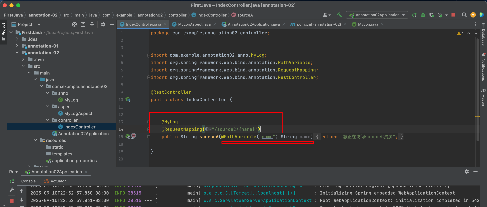

# Java自定义注解及使用场景

> Java自定义注解一般使用场景为：自定义注解+拦截器 或  自定义注解+AOP

# 一、什么是注解

> Java注解又称Java标注，是JDK5.0版本开始支持加入源代码的特殊语法元数据。
>  Java语言中的类、方法、变量、参数和包等都可以被标注。和Javadoc不同，Java标注可以通过反射获取标注内容。在编译器生成类文件时，标注可以被嵌入到字节码中。Java虚拟机可以保留标注内容，在运行时可以获取到标注内容。 当然它也支持自定义Java标注。

# 二、注解体系图

元注解：`java.lang.annotation`中提供了元注解，可以使用这些注解来定义自己的注解。主要使用的是Target和Retention注解。


Java中提供了获取注解的支持。`java.lang.reflect.AnnotationElement`接口。


只要我们通过反射拿到`Class`，`Method`，`Field`类，就能使用`getAnnotation(Class)`方法拿到我们想要的注解。

# 三、常用元注解

## 1、@Target

描述了注解修饰的对象范围，取值在`java.lang.annotation.ElementType`定义，常用的包括：

- METHOD：用于描述方法
- PACKAGE：用于描述包
- PARAMETER：用于描述方法变量
- TYPE：用于描述类、接口或enum类型

## 2、@Retention

表示注解保留时间长短。取值在`java.lang.annotation.RetentionPolicy`中定义，常用的包括：

- SOURCE：在源文件中有效，编译过程中会被忽略
- CLASS：随源文件一起编译在class文件中，运行时忽略
- RUNTIME：在运行时有效

只有定义为**RetentionPolicy.RUNTIME**时，我们才能通过反射获取到注解。

```java
// 例子：
@Target(ElementType.FIELD)  					//  注解用于字段上
@Retention(RetentionPolicy.RUNTIME)   //  保留到运行时，可通过注解获取
public @interface MyField {
    String description();
    int length();
}
```

```java
package annotation;

import java.lang.reflect.Field;

public class MyFieldTest {
    
    //使用自定义注解
    @MyField(description = "张三", length = 98)
    private String userName;

    public static void main(String[] args) {
        new MyFieldTest().testMyField();
    }

    public void testMyField(){
        Class c = MyFieldTest.class;
        Field[] declaredFields = c.getDeclaredFields();
        for(Field f : declaredFields){
            System.out.println(f.getName());  //字段名称
            if(f.isAnnotationPresent(MyField.class)){
                MyField annotation = f.getAnnotation(MyField.class);
                System.out.println(annotation.description());
                System.out.println(annotation.length());
            }
        }
        
    }
}

```


# 四、自定义注解+拦截器，实现登陆校验


现在实现拦截器:


将拦截器添加到spring中。


可以看到，拦截器发挥了作用。


现在我们可以自定义注解，并且将注解的功能在拦截器中实现，这样自定义注解的功能便发挥了。

为了让注解能够在方法上使用：


但是这个地方的强转会报错：


# 五、自定义注解+AOP实现，日志打印


定义controller



定义切面类，绑定切点，对切点实现环绕通知。

```java
package com.example.annotation02.aspect;

import org.aspectj.lang.ProceedingJoinPoint;
import org.aspectj.lang.annotation.Around;
import org.aspectj.lang.annotation.Aspect;
import org.aspectj.lang.annotation.Pointcut;
import org.springframework.stereotype.Component;

@Aspect  //1、表明是一个切面类
@Component
public class MyLogAspect {

    //2、切点，@annotation表示这个切点切到一个注解上，后面应该写这个注解的全类名
    @Pointcut("@annotation(com.example.annotation02.anno.MyLog)")
    public void loginPointCut(){
//        System.out.println("hi");
    }

    //3、环绕通知
    @Around("loginPointCut()")
    public void loginAround(ProceedingJoinPoint joinPoint){
        // 获取方法名称
        String methodName = joinPoint.getSignature().getName();
        // 获取入参
        Object[] param = joinPoint.getArgs();
        StringBuilder sb = new StringBuilder();
        for(Object o : param){
            sb.append(o + "; ");
        }
        System.out.println("进入[" + methodName + "]方法,参数为:" + sb.toString());

        // 继续执行方法
        try {
            joinPoint.proceed();
        } catch (Throwable throwable) {
            throwable.printStackTrace();
        }
        System.out.println(methodName + "方法执行结束");

    }
}

```


启动，观察注解是否产生作用。

