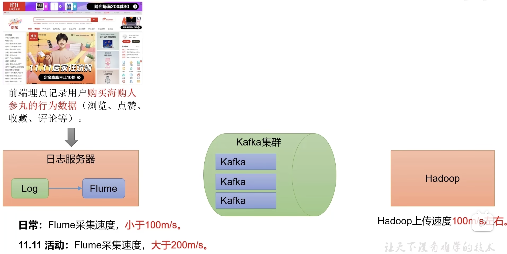
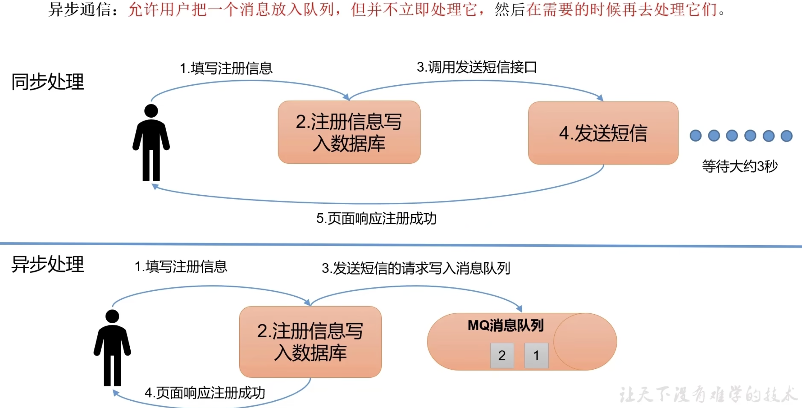
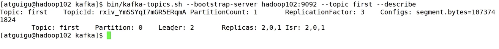
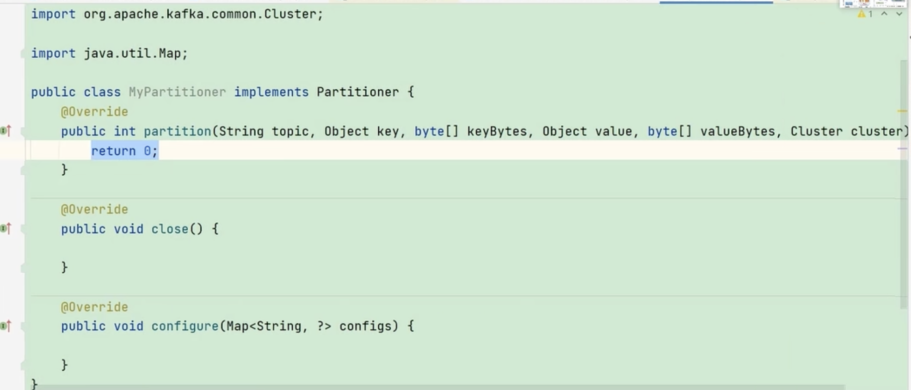
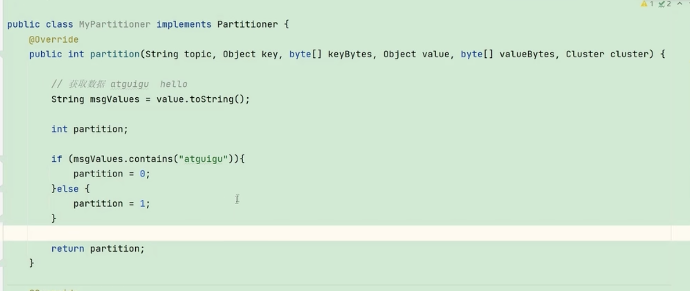
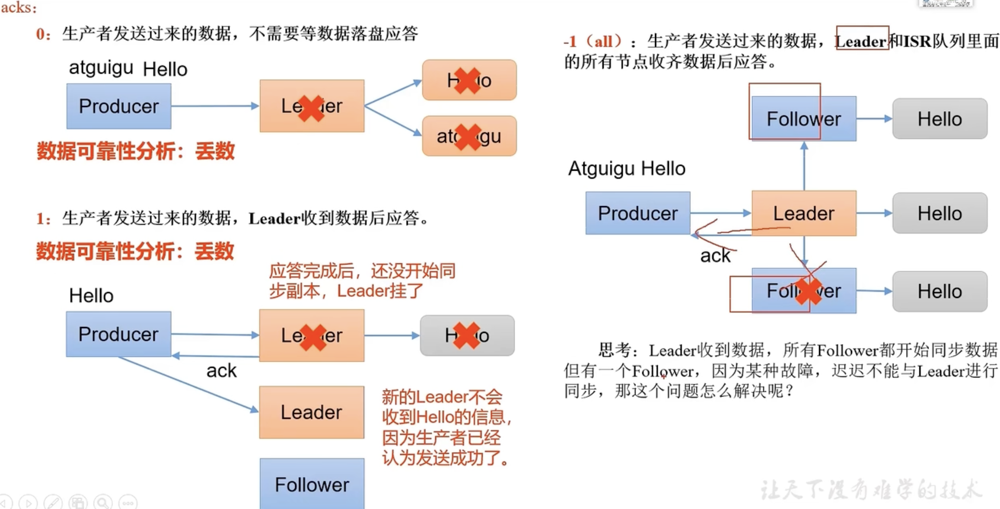
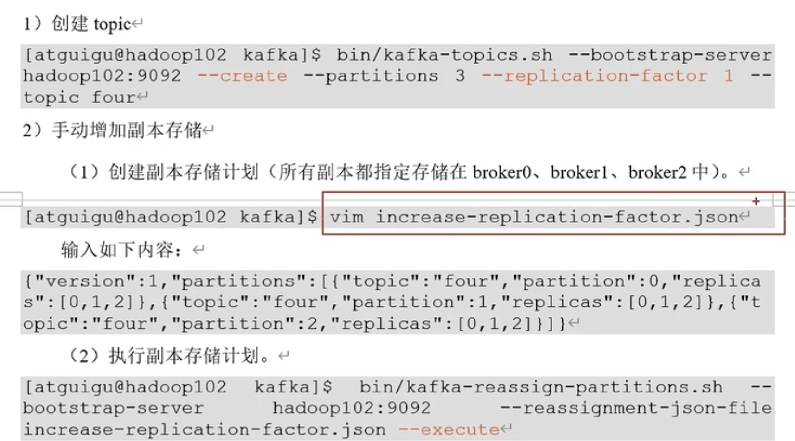

# 一、Kafka定义



**Kafka传统定义**：Kafka是一个**分布式**的基于**发布/订阅模式**的**消息队列**，主要用于大数据实时处理领域。

**发布/订阅**：消息的发布者不会将消息直接发送给订阅者，而是将发布的消息分为不同的类别，订阅者值接受感兴趣的消息。

**Kafka最新定义**：KafKa是一个开源的分布式**事件流平台**（Event Streaming Platform），被广泛应用于高性能数据管道、流分析、数据集成和关键任务应用。

目前企业中比较常见的消息队列产品主要有Kafka、ActiveMQ、RabbitMQ、RocketMQ等。在大数据场景主要采用Kafka作为消息队列。在JavaEE开发中主要采用AcitveMQ、RabbitMQ、RocketMQ。传统的消息队列的主要应用场景包括：**缓存/削峰、解耦、异步通信**。




## 1.1 消息队列的两种模式

**1）点对点模式**

**2）发布/订阅模式。 **（基本上都使用发布/订阅模式）


## 1.2 KafKa结构


# 二、KafKa安装

```shell
tar -zxvf <tar包名> -C <目录名>
# -z：压缩和解压缩 ".tar.gz" 格式；
```


kafka安装，官网下载包，tar命令解压即可。

# 三、KafKa使用


创建名为`first`的主题，分区数量为`1`，分区副本为`3	`。


查看主题的详情信息，发现当前的分区为0，有三个分区副本，分别在三台机器上`2，0，1`。Leader为`2`，说明Hadoop104机器上的分区是工作分区，当前机器和Hadoop上的分区都是作为follower的，是不工作的。【只有leader的分区是工作的】




接下来，修改分区数量为`3`，【注意：分区数量只能增加，不能减少】。


创建生产者，向topic中传递数据。创建消费者，查看数据是否被传递到topic中。


发现读不到数据，因为需要先订阅后发布。那么现在再生产一条消息。


可以发现，现在可以收到消息了。那么之前的消息能不能获取到呢。加上一个参数即可。`--from-beginning`，现在历史消息也可以读取到了。


# 四、KafKa生产者原理


测试一下 version2.0
复现pull代码的错误


## 4.1、自定义分区

研发人员可以根据企业需求，自己重新实现分区器。

1）需求

  例如我们需要实现一个分区器，发送过来的数据中如果包含atguigu，就发送至0号分区，不包含atguigu，就发送至1号分区。

2）实现步骤

（1）定义类实现Partitioner接口

（2）重写partition()方法






自定义分区器一般用于过滤脏数据。


如果linger.ms改得比较大，那么数据的延迟就会比较高。

## 4.2 KafKa使用步骤

> 0. 创建配置properties并设置相应参数
> 1. 创建Kafka生产者，前述配置作为生产者的参数
> 2. 发送数据，此时需要指定主题
> 3. 关闭资源


## 4.3 生产者—数据可靠




## 4.4 数据重复如何解决


# 五、Borker原理


## 5.1 KafKa Broker总体工作流程


## 5.2 服役和退役（这部分上网查询下吧）

1）准备一台服务器hadoop100

2）对哪个主题操作

3）形成计划

4）执行计划

5）验证计划

## 5.3 kafka副本

（1）副本的作用：提高数据可靠性

（2）KafKa默认副本1个，生产环境一般配置为2个，保证数据可靠性，太多副本增加磁盘存储空间，增加网络上数据传输，降低效率。

（3）KafKa中副本分为：Leader和Follower。KafKa生产者只会把数据发往Leader，然后Follower找Leader进行同步数据。

（4）KafKa分区中所有副本统称为AR（Assigned Repllicas）。AR = ISR + OSR

**ISR：**表示和Leader保持同步的Follower集合。如果Follower长时间未向Leader发送通信请求或同步数据，则该Follewer将被踢出ISR。该时间阈值由**replica.lag.time.max.ms**参数设定，默认30s。Leader发生故障后，就会从ISR中选举新的Leader。

**OSR：**白噢是Follower与Leader副本同步时，延迟过多的副本。

意思就是所有副本都在AR里，ISR中副本正常，OSR中副本不正常。

## 5.4 Leader和Follower故障处理细节


## 5.5 分区副本匹配（16个分区，三个副本）


## 5.6 手动调整分区副本


## 5.7 Leader Partition负载平衡

## 5.8 增加副本因子



## 5.9 文件存储机制


## 5.10 文件清理策略


## 5.11 高效读取数据


# 六、消费者原理

## 6.1 消费者消费方式


## 6.2 消费者总体工作流程


## 6.3 消费者组

- Consumer Group（CG）：消费者组，由多个consumer组成，形成一个消费者组的条件是所有消费者的groupid相同。

- 消费者组内每个消费者负责消费不同分区的数据，一个分区只能由一个组内消费者消费。

- 消费者组只爱你互不影响。所有消费者都属于某个消费者组，即消费者组是逻辑上的一个订阅者。

  【视频中说这样设计的目的是为了后续去重的问题，不理解！！！】

  


