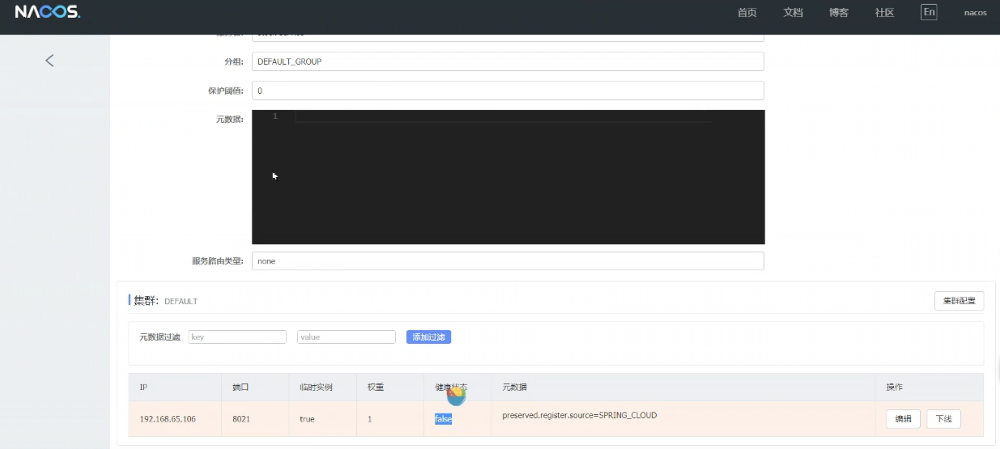

# Spring

```
目标: https://github.com/mafei007even/Spring-impl

在b站学习了老师的 Spring 原理课程之后，独立完成写了个仿 Spring 轮子项目，实现功能包括：
1. @ComponentScan 组件扫描
2. bean 完整的生命周期过程（创建-依赖注入-初始化-销毁），包括 Bean后处理器（BeanPostProcessor）的调用、各种 Aware 接口回调、执行销毁方法。
3. 使用三级缓存解决属性注入和 set 方法注入的循环依赖问题，@Lazy 注解、ObjectFactory 解决构造方法注入的循环依赖问题
4. 完成了 5 种通知类型（@Before、@AfterReturning、@After、@AfterThrowing、@Around）的解析，对符合切点的目标对象进行代理增强。 应用在目标方法上的多个通知会链式调用执行，且实现了通知的调用顺序控制。

用到的设计模式：代理（JDK 生成动态代理）、责任链（通知的链式调用）、适配器（适配各种销毁方法的调用）、单例（比较器）、工厂（ObjectFactory）

参考 Spring 源码实现，类名几乎都和 Spring 类名一致，代码质量我个人觉得还行，加上接口和注解，一共写了近 50 个类，没有依赖别的 jar 包，直接复制代码就能运行。

有感兴趣的同学的可以瞅瞅，跟着老师课程学完了也可以自己动手写一个轮子项目，对理解 Spring 运行流程很有帮助，搞懂了直接简历项目 + 1
```


## 1.入门

```java
package com.example.liu;

import org.junit.jupiter.api.Test;
import org.springframework.context.ApplicationContext;
import org.springframework.context.support.ClassPathXmlApplicationContext;

public class Tests {

    @Test
    public void testUserObject(){
        //加载Spring配置文件，创建对象, 说明反射是通过无参构造方法来创建对象交由spring容器管理的
        ApplicationContext context = new ClassPathXmlApplicationContext("bean.xml");
        User user = (User) context.getBean("user");
        System.out.println("line1:" + user);   //line1:com.example.liu.User@6221a451
        System.out.println("line2:" + user);   //line2:com.example.liu.User@6221a451
        user.add();  //add()方法
    }
}
```

反射如何创建对象？创建后的对象放在哪里？

```java
1.解析XML文件获得bean标签；
2.反射根据类的全路径创建对象; 
   //通过反射创建对象
    @Test
    public void testCreateObject() throws ClassNotFoundException, NoSuchMethodException, InvocationTargetException, InstantiationException, IllegalAccessException {
        Class clazz = Class.forName("com.example.liu.User");
        User u = (User) clazz.getDeclaredConstructor().newInstance();
        u.add();
    }

创建后的对象放在 Map<String,BeanDefinition> beanDefinitionMap
key是配置文件中id唯一标识，BeanDefinition是类的描述信息
这个map在DefaultListableBeanFactory类中
```

## 2.IOC控制反转

Spring通过IOC容器来管理所有Java对象的实例化和初始化，控制对象与对象之间的依赖关系。我们将由IOC容器管理的Java对象称为Spring Bean，它与使用关键字new创建的Java对象没有任何区别。

如果一个接口只有一个实现类，那么根据接口类型可以获取bean吗？

> 可以，因为bean唯一

如果一个接口有多个实现类，这些实现类都配置了bean，那么根据接口类型可以获取bean吗？

> 不行，因为bean不唯一

### 2.1依赖注入

创建对象过程中，向属性中设置值，有两种方法实现。

`setter注入` 

`构造器注入`

### 2.2 bean的作用域

```
在Spring中可以通过配置bean标签的scope属性来指定bean的作用域范围
singleton（默认）   单实例    创建对象的时机：IOC容器初始化时
prototype          多实例    创建对象的时机：获取bean时

如果是在WebApplicationContext环境下还会有另外的几个作用域（但不常用）:
request    在一个请求范围内有效
session    在一个会话范围内有效
```

## 2.3 bean的生命周期

- bean对象的创建（调用无参数构造）

- bean对象设置相关属性

- bean后置处理器（初始化之前）

- bean对象初始化（调用指定初始化方法）

- bean后置处理器（初始化之后）

- bean对象创建完成，使用

- bean对象销毁（配置指定销毁的方法）

  ```text
  bean的后置处理器会在生命周期的初始化前后添加额外的操作，需要实现BeanPostProcessor接口，且配置到IOC容器中，需要注意的是，bean后置处理器不是单独针对某一bean生效，而是针对IOC中所有bean都会执行。
  ```

# SpringBoot

> **带着疑问阅读代码**
>
> 1.starter是什么？我们如何去使用这些starter？
>
> 2.为什么包扫描只会扫描核心启动类所在的包以及子包？
>
> 3.在SpringBoot启动的过程中，是如何完成自动装配的？
>
> 4.内嵌Tomcat是如何被创建以及启动的？
>
> 5.使用了web场景对应的starter，Spring MVC是如何自动装配的？

## 一、源码阅读

SpringBoot中核心注解：

```java
@SpringBootConfiguration  //声明主配置类
@EnableAutoConfiguration   //自动装配，核心中的核心
@CompomentScan  //包扫描
```

`Spring`中有很多以`Enable`开头的注解，其作用就是借助`@Import`来收集并注册特定场景的相关的`Bean`，并加载到`IOC`容器。


# SpringCloud

## 一、项目创建

定义一个springboot项目，名称为`springBootAlibaba`，在pom文件中设置打包方式为

```xml
<packaging>pom</packaging>
```

因为我们是在`springBootAlibaba`项目下创建微服务，所以不直接在`springBootAlibaba`开发。在`springBootAlibaba`项目的`pom.xml`中添加如下依赖，以保证其下的子项目能继承这些依赖。

```xml
<dependencies>
    <dependency>
        <groupId>org.springframework.boot</groupId>
        <artifactId>spring-boot-starter</artifactId>
    </dependency>
    <dependency>
        <groupId>org.springframework.boot</groupId>
        <artifactId>spring-boot-starter-web</artifactId>
    </dependency>
    <dependency>
        <groupId>org.springframework.boot</groupId>
        <artifactId>spring-boot-starter-test</artifactId>
        <scope>test</scope>
    </dependency>
</dependencies>
```

接下来创建`order`和`stock`子项目，这里可以使用创建maven的向导。构建好之后，手动添加如下所示启动类。

```java
package com.liu.stock;

import org.springframework.boot.SpringApplication;
import org.springframework.boot.autoconfigure.SpringBootApplication;

@SpringBootApplication
public class StockApplication {
    public static void main(String[] args) {
        SpringApplication.run(StockApplication.class, args);
    }
}
```

order中启动类稍微有些特殊，我们构建了以RestTemplate的Bean，并交由springboot容器管理。

```java
package com.liu.order;

import org.springframework.boot.SpringApplication;
import org.springframework.boot.autoconfigure.SpringBootApplication;
import org.springframework.boot.web.client.RestTemplateBuilder;
import org.springframework.context.annotation.Bean;
import org.springframework.web.client.RestTemplate;

@SpringBootApplication
public class OrderApplication {
    public static void main(String[] args) {
        SpringApplication.run(OrderApplication.class, args);
    }

    @Bean
    public RestTemplate restTemplate(RestTemplateBuilder builder){
        RestTemplate restTemplate = builder.build();
        return restTemplate;
    }
}
```

创建RestTemplate的目的是为了实现服务之间（springboot的一种技术支持）的调用。

接下来设置端口，order服务端口设置为8010，stock服务端口设置为8011。


并且创建对应的controller示例，如下：

```java
package com.liu.order.controller;


import org.springframework.beans.factory.annotation.Autowired;
import org.springframework.web.bind.annotation.RequestMapping;
import org.springframework.web.bind.annotation.RestController;
import org.springframework.web.client.RestTemplate;

@RestController
@RequestMapping("/order")
public class OrderController {

    //使用RestTemplate的方式来实现服务之间调用
    @Autowired
    RestTemplate restTemplate;

    @RequestMapping("/add")
    public String add(){
        String templateForObject = restTemplate.getForObject("http://localhost:8011/stock/reduct", String.class);

        return "订单微服务" + templateForObject;
    }
}
```

```java
package com.liu.stock.controller;


import org.springframework.web.bind.annotation.RequestMapping;
import org.springframework.web.bind.annotation.RestController;

@RestController
@RequestMapping("/stock")
public class StockController {

    @RequestMapping("/reduct")
    public String reduct(){
        return "库存微服务";
    }
}
```

现在我们可以在order服务中，通过RestTemplate向指定`ip+port+路径`发起请求，并且拿到返回的结果。


可以看到两个服务之间是互通的。

## 二、SpringCloud和SpringCloudAlibaba的引入

`springBootCloudAlibaba`项目引入**SpringCloud**、**SpringCloudAlibaba**依赖，pom.xml文件改造如下。

```xml
<?xml version="1.0" encoding="UTF-8"?>
<project xmlns="http://maven.apache.org/POM/4.0.0" xmlns:xsi="http://www.w3.org/2001/XMLSchema-instance"
         xsi:schemaLocation="http://maven.apache.org/POM/4.0.0 https://maven.apache.org/xsd/maven-4.0.0.xsd">
    <modelVersion>4.0.0</modelVersion>
    <packaging>pom</packaging>
    <modules>
        <module>order</module>
        <module>stock</module>
    </modules>
    <!-- 预留空间给自己公司项目的依赖版本管理    -->
    <groupId>com.liu</groupId>
    <artifactId>springBootCloudAlibaba</artifactId>
    <version>0.0.1-SNAPSHOT</version>
    <name>springBootCloudAlibaba</name>
    <description>springBootCloudAlibaba</description>
    <properties>
        <java.version>1.8</java.version>
        <springCloudALibaba.version>2.2.5.RELEASE</springCloudALibaba.version>
        <springBoot.version>2.7.16</springBoot.version>
        <springCloud.version>Hoxton.SR8</springCloud.version>
    </properties>
    <dependencies>
        <dependency>
            <groupId>org.springframework.boot</groupId>
            <artifactId>spring-boot-starter</artifactId>
        </dependency>
        <dependency>
            <groupId>org.springframework.boot</groupId>
            <artifactId>spring-boot-starter-web</artifactId>
        </dependency>
        <dependency>
            <groupId>org.springframework.boot</groupId>
            <artifactId>spring-boot-starter-test</artifactId>
            <scope>test</scope>
        </dependency>
    </dependencies>

    <dependencyManagement>
        <dependencies>
            <!--   SpringCloudAlibaba 的版本管理，通过dependency完成继承 -->
            <dependency>
                <groupId>com.alibaba.cloud</groupId>
                <artifactId>spring-cloud-alibaba-dependencies</artifactId>
                <version>${springCloudALibaba.version}</version>
                <type>pom</type>
                <scope>import</scope>
            </dependency>
            <!--    springboot的版本管理        -->
            <dependency>
                <groupId>org.springframework.boot</groupId>
                <artifactId>spring-boot-starter-parent</artifactId>
                <version>${springBoot.version}</version>
                <type>pom</type>
                <scope>import</scope>
            </dependency>
            <!-- springCloud的版本管理 -->
            <dependency>
                <groupId>org.springframework.cloud</groupId>
                <artifactId>spring-cloud-dependencies</artifactId>
                <version>${springCloud.version}</version>
                <type>pom</type>
                <scope>import</scope>
            </dependency>
        </dependencies>
    </dependencyManagement>
    <build>
        <plugins>
            <plugin>
                <groupId>org.springframework.boot</groupId>
                <artifactId>spring-boot-maven-plugin</artifactId>
            </plugin>
        </plugins>
    </build>

</project>
```

## 三、微服务架构培训课

**分布式事务**

zookeepker+Dubbo

SpringCloudAlibaba【包含nacos服务注册中心、】


## 四、nacos介绍

nacos是一个更易于构建云原生应用的动态服务发现、服务配置和服务管理的平台。

集**注册中心+配置中心+服务管理**平台。

### 1.注册中心演变及其设计思想

首先服务注册比较直观的思路是维护一份注册表，表中存储ip，端口号，服务名称等信息。但是会存在一个问题：这种静态存储的思路对于服务的的扩容缩容问题难以解决，比如某个订单服务宕机了，如何去发现这个宕机呢？存储肯定是必要的，但不应该仅仅去存储，还应该做到发现和管理。

历史上使用了nginx维护服务列表。但是nginx没有对服务进行监控和实时检查的功能。

**1.**服务注册。

**2.**调用服务时，获取服务。


**引入心跳机制，定时拉去取服务列表，缓存到客户端：**


每一个微服务都是nacos的客户端。

### 2.核心功能

**服务注册：**Nacos Client会通过发送REST请求的方式向Nacos Server注册自己的服务，提供自身的元数据，比如ip地址、端口等信息。Nacos Server接收到注册请求后，就回把这些元数据信息存储在一个双层的内存map中。

**服务心跳：**在服务注册后，Nacos Client会维护一个定时心跳来持续通知Nacos Server，说明服务一直处于可用状态，防止被剔除，默认每5s发送一次心跳。

**服务同步：**Nacos Server集群之间会互相同步服务实例，同来保证服务信息的一致性。 Leader   raft

**服务发现：**服务消费者（Nacos Client）在调用服务提供者的服务时，会发送一个REST请求给Nacos Server，获取上面注册的服务清单，并且缓存在Nacos Client本地，同时在Nacos Client本地开启一个定时任务定时拉取服务端最新的注册表信息更新到本地缓存。

**服务健康检查：**Nacos Server会开启一个定时任务用来检查注册服实例的健康情况，对于超过15s没有收到客户端心跳的实例会将它的healthy属性设置为false（客户端获取服务时，这个服务不会被发现）。如果某个实例超过30s没有收到心跳，直接剔除盖实例（被剔除的实例如果恢复，发送心跳则会重新注册）。

### 3.主流的服务注册中心对比


CAP               C一致性               A可用性           P分区容错性

Nacos支持CP和AP的切换，默认是AP。

### 4.Nacos Server部署

github上下载安装，启动，默认启动时采用集群模式，需要在sh文件中修改为standalone单机模式。启动后可以访问本机的8848端口进入nacos页面。用户名：nacos，密码：nacos。


现在自己开发的项目（订单服务和库存服务）需要添加nacos注册了。首先在子项目中添加好依赖。注意，之前我们在父项目中添加的是版本管理器，如果子项目需要用到nacos，还是需要引入依赖的，只不过不需要引入依赖本本了。


接下来在yml配置文件中设置nacos的配置信息。


点击详情之后的界面：



现在服务之间的调用，就可以通过服务名称来进行。

不过在调用的时候需要加上一个`@loadBalanced`注解来区别服务名称调用和ip地址调用。负载均衡器负责解析服务名称和ip地址的映射。


现在我们再加上一个库存服务（即一个订单服务，两个库存服务），我们想验证负载均衡注解是否具备轮询服务的作用。


# K8S

# Redis

# Docker

# Nginx


Mybatis